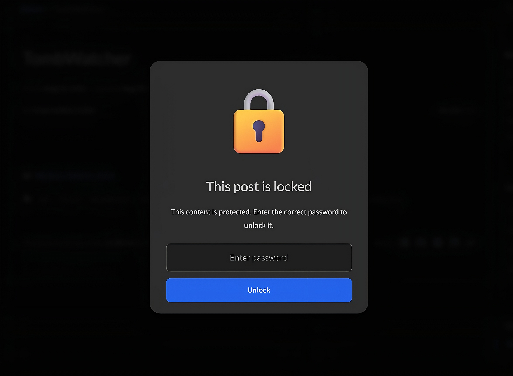
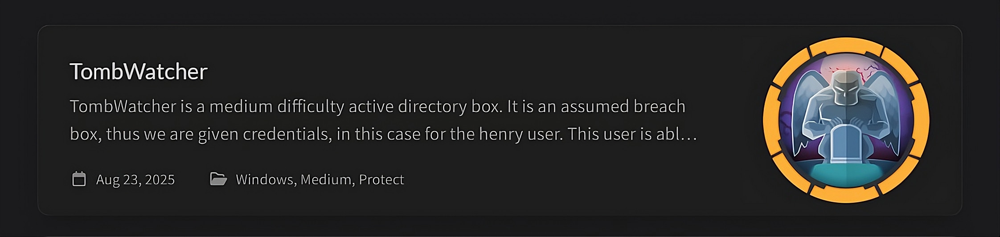

# Chirpy Page Protector Plugin
This plugin provides two layers of protection for your Chirpy-based Jekyll blog:

1. Markdown-level encryption – prevents sensitive posts from being exposed in your GitHub repository.
2. Site-level encryption – ensures published pages are locked behind a password modal.

## Features

🔒 AES-256-CBC encryption with HMAC-SHA256 integrity checks

🖼️ User-friendly modal that prompts for a password

⚡ Client-side decryption using the Web Crypto API

📝 Protects only posts in the Active category (configurable by editing the script)

🎯 Works with Chirpy theme’s generated _site content

⚠️ Important Notes
You must encrypt your markdown files with the encrypt_md.py script before pushing changes to your repository.

If you leave them unencrypted:
1. The raw markdown files (including sensitive write-ups) will remain publicly accessible in your GitHub repository.
2. The generated site will still be encrypted, but someone could bypass it by directly reading your repo.

## Installation for Github Pages

1. Copy the two ruby plugins into your `_plugins` folder.
2. Copy the python script to your project's root dir
3.  Add the required gems to your Gemfile:
```
gem "nokogiri"
```
4. Modify .github/workflows/pages-deploy.yml to run the protector after site build:
```yaml
- name: Run site protector
  run: bundle exec ruby _plugins/protector.rb
  env:
    PROTECTOR_PASSWORD: ${{ secrets.PROTECTOR_PASSWORD }}
```
5. Add your password as a GitHub Actions secret:
Go to Settings → Secrets and variables → Actions → New repository secret
Name it PROTECTOR_PASSWORD

##  Usage 
1. To encrypt markdown files and posts make sure that in your categories section you have written `Protect`
2. Local Encryption of Markdown Files
Use the Python script to encrypt posts with the Active category before committing:
```
PROTECTOR_PASSWORD="yoursecret" python encrypt_md.py
```
* This replaces the .md file with an encrypted YAML blob (first line starts with ciphertext:).
* You should only commit the encrypted versions to GitHub.
* Make sure that the password you use to encrypt markdown files is the same as the one in you GitHub env

## 🔄 How It Works
### 🔐 Markdown-Level Encryption

1. `encrypt_md.py` searches _posts/ for files with the `Protect` category.
2. The script encrypts the full markdown with AES-256-CBC + PBKDF2-HMAC-SHA256.
3. The file is replaced with encrypted YAML (ciphertext, iv, salt, hmac).
4. Only encrypted files should be pushed to GitHub.

### 🔓 Auto-Decryption (Build Step)

1. `decrypt_md.rb` runs during the Jekyll build.
2. If a file starts with ciphertext:, it is decrypted using your password.
3. Jekyll builds the site normally.

### 🔒 Site-Level Encryption (Deployment Step)

1. After build, protector.rb searches for posts in the Protect category.
2. The .content block is encrypted with AES-256-CBC.
3 .The block is replaced with a modal + client-side WebCrypto decryption script.
4. Visitors must enter the password to view content.

## Demo UI (Modal)

When users access a protected post, they’ll see:


Users will still be able to read a small preview form the home page 


